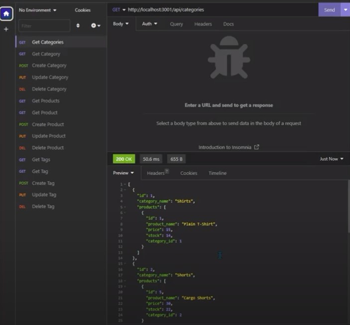
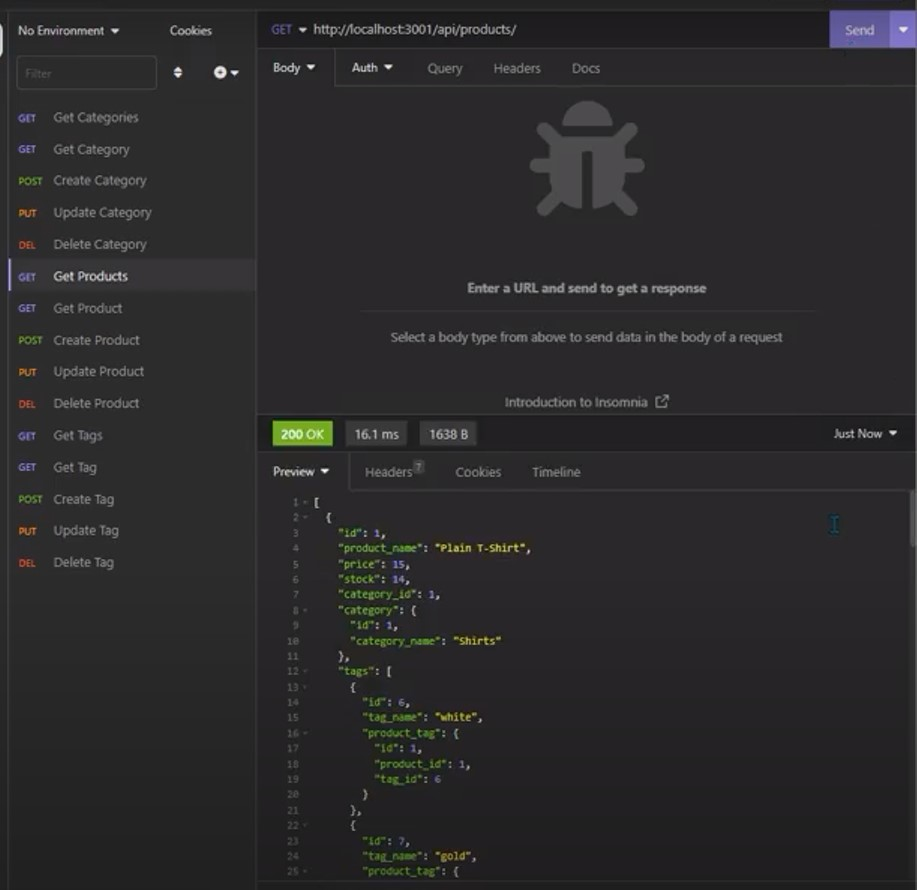
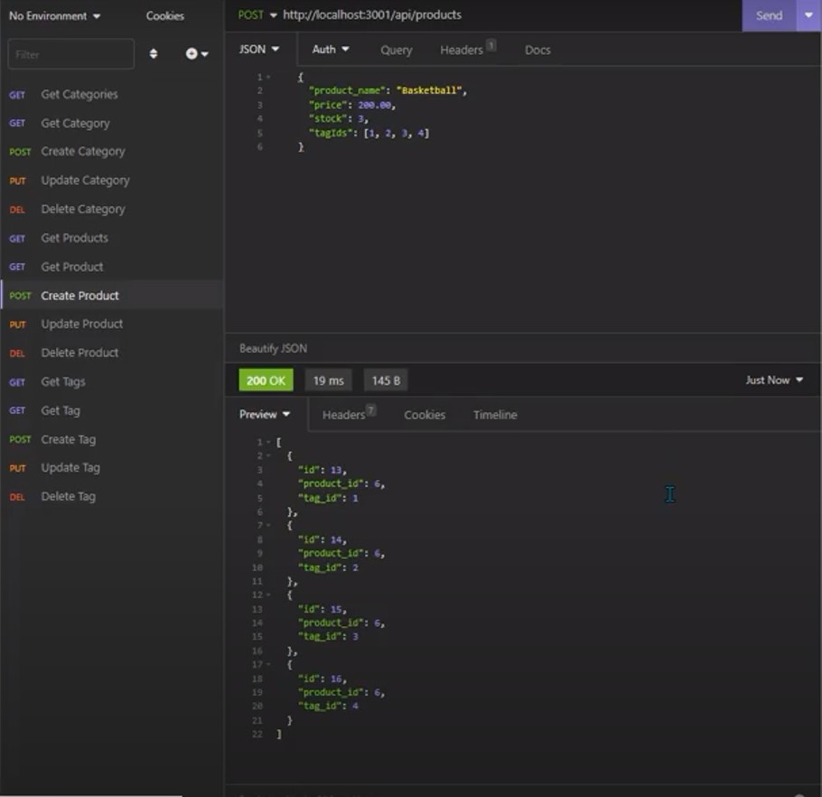

# Back-End-Tech

## Decription
This application was being used in the backend to create an Ecommerce platform. Ecommerce is an online platform for businesses.
This project will build out a fully functioning restful API backend utilizing Node.js, Express
and MySQL as its primary technology stack. The goal here is not only to demonstrate
proficiency but also provide guidance on how best to structure your code base so it's easy to maintain.

## Installation
MySQL2, Sequelize, Dotenv Package, Package.Json

## User Story
AS A manager at an internet retail company 
I WANT a back end for my e-commerce website that uses the latest technologies 
SO THAT my company can compete with other e-commerce companies

## Acceptance Criteria
GIVEN a functional Express.js API 
WHEN I add my database name, MySQL username, and MySQL password to an environment variable file 
THEN I am able to connect to a database using Sequelize 
WHEN I enter schema and seed commands 
THEN a development database is created and is seeded with test data 
WHEN I enter the command to invoke the application 
THEN my server is started and the Sequelize models are synced to the MySQL database 
WHEN I open API GET routes in Insomnia Core for categories, products, or tags 
THEN the data for each of these routes is displayed in a formatted JSON 
WHEN I test API POST, PUT, and DELETE routes in Insomnia Core 
THEN I am able to successfully create, update, and delete data in my database

## Usage

## Links
[Recorded Link](https://drive.google.com/file/d/1EdktciSXrIBH0JjPijqspmJ0uCNs87oZ/view)

[Github Repo](https://github.com/Lexxvasquez/Back-End-Tech)